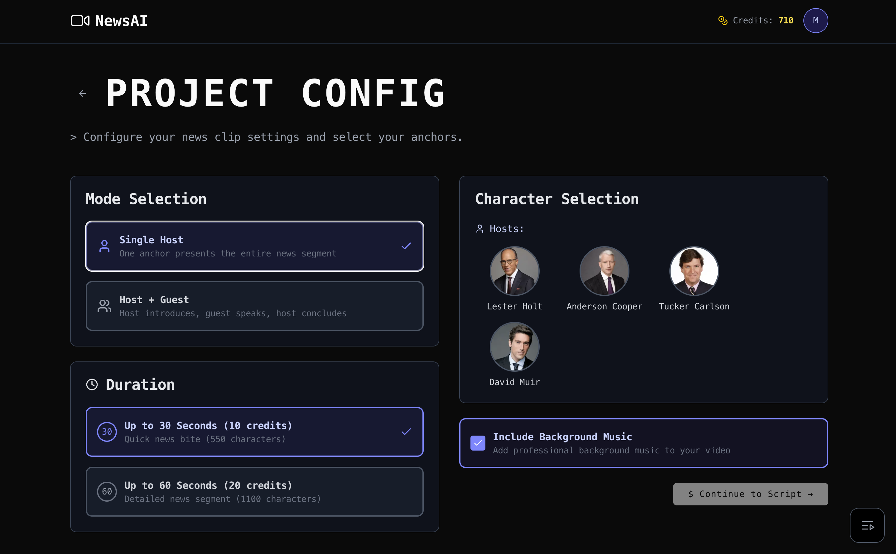
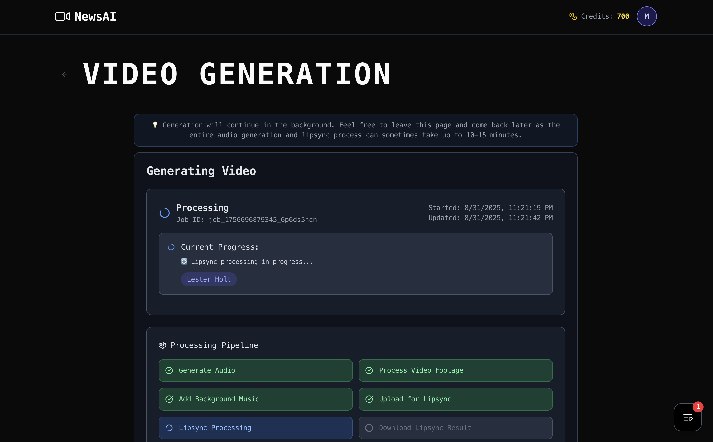
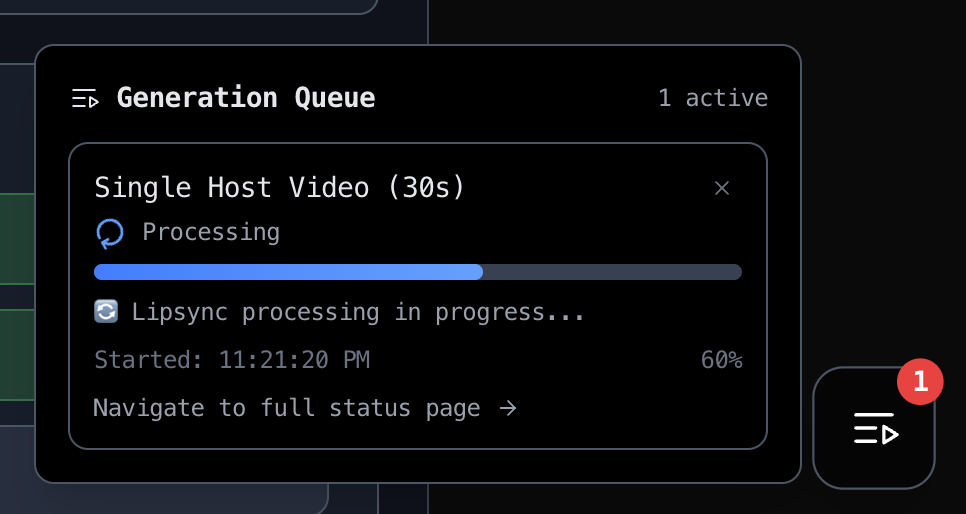
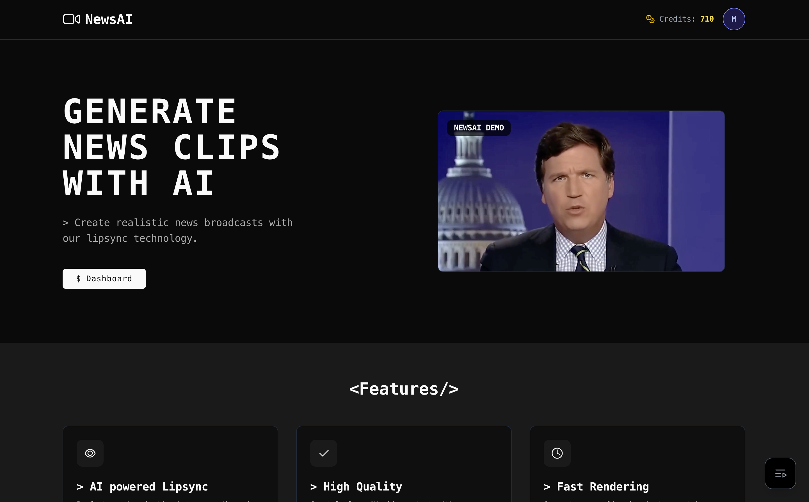

# NewsAI

**AI-powered news video generation platform** that creates realistic news broadcasts with advanced lip-sync technology.

**Live Site:** [NewsAI](https://newsai.wtf)

## What is NewsAI?

NewsAI transforms written scripts into professional-quality news videos featuring AI anchors. Choose from famous news personalities, write your script, and generate broadcast-ready content in minutes.

### Key Features

- **News Anchors**: Choose from well-known news personalities like Anderson Cooper, Lester Holt, and more
- **Advanced Lip-Sync**: Perfect audio-visual synchronization using cutting-edge AI technology
- **Multiple Formats**: Single-host presentations or host-guest interview styles
- **Fast Generation**: Create 30-60 second videos in 10-15 minutes
- **Credit-Based Pricing**: Pay only for what you generate (10-20 credits per video)

## How It Works

### 1. Configure Your Video

Select your anchor, choose video length, and pick your format (single host or host + guest interview).

### 2. Write Your Script

Input your news script with character limits and real-time validation to ensure optimal video quality.

### 3. Generate & Track Progress

Watch real-time progress as AI processes your script into a professional news broadcast.

### 4. Get Notified

Receive instant notifications when your video is ready, with automatic credit refunds if generation fails.

### 5. Purchase Complete

Seamless payment processing with Stripe integration for credits and subscriptions.

## Technology Stack

- **Frontend**: Next.js, TypeScript, Tailwind CSS
- **Backend**: tRPC, PostgreSQL, Drizzle ORM
- **Authentication**: Clerk
- **Payments**: Stripe
- **AI Integration**: External video generation APIs
- **Deployment**: Vercel

## Features Showcase

